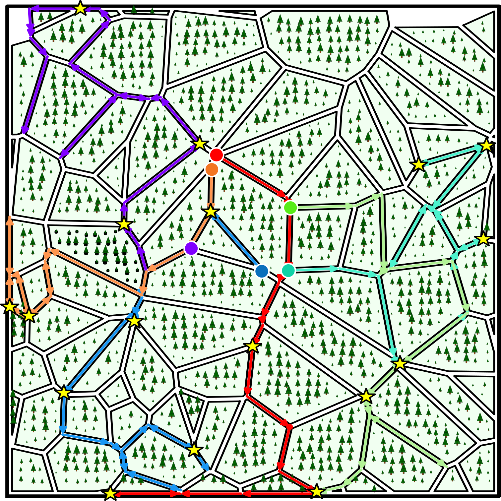
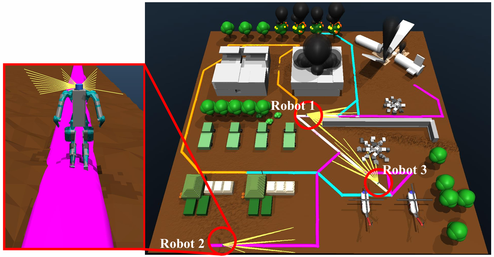
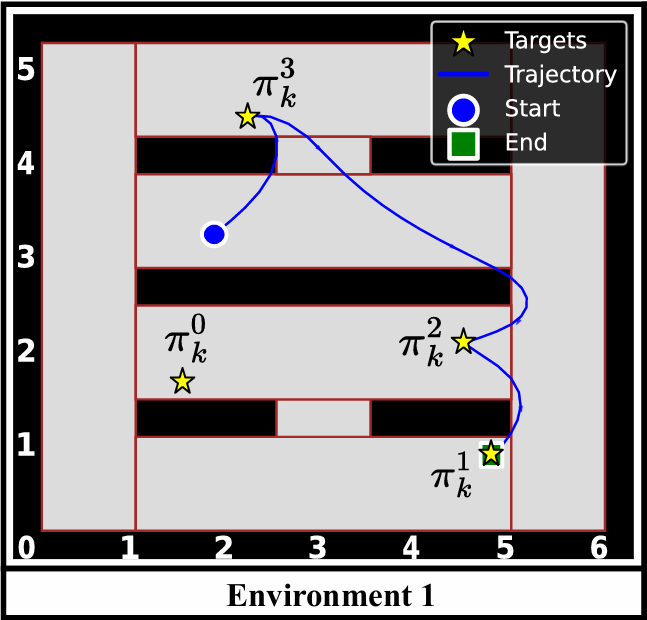
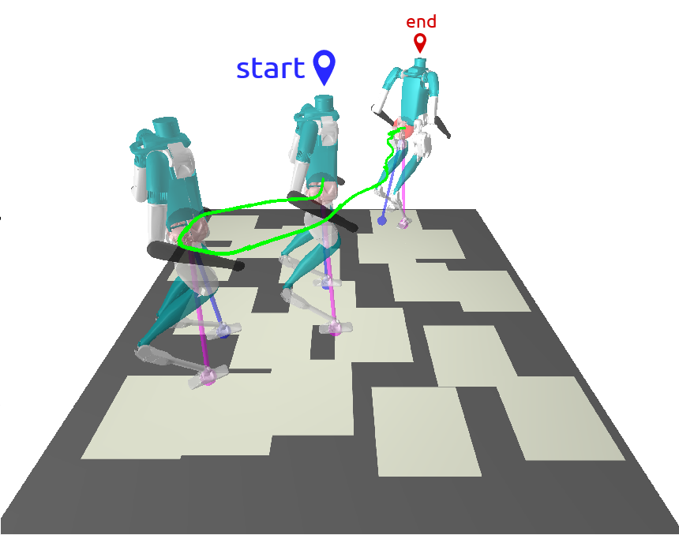
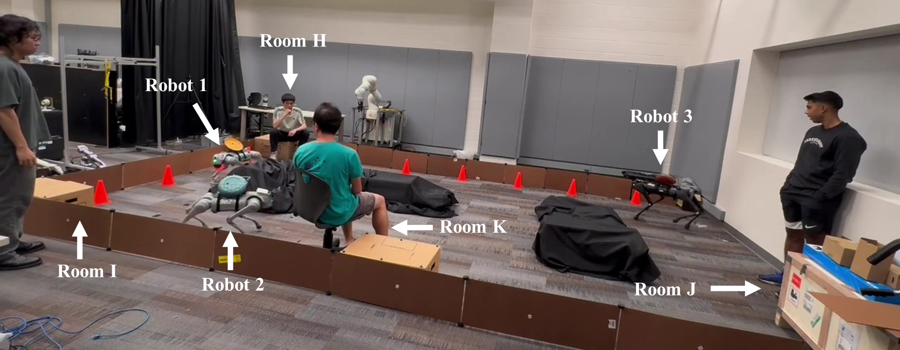
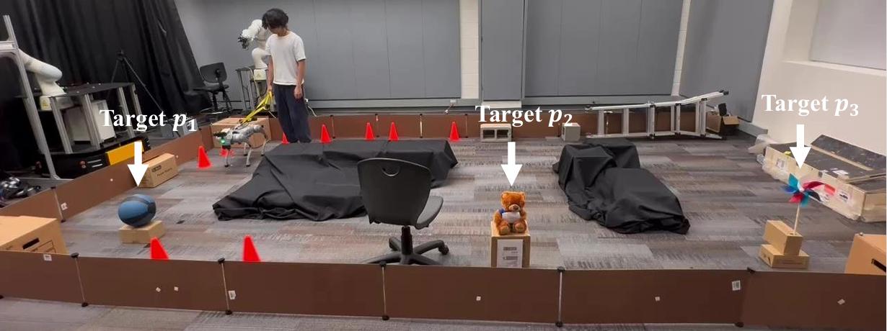

# Logic Network Flow (LNF)

A task and motion planning framework under temporal logic specifications. LNF provides **provably tighter convex relaxations** by encoding temporal logic as network flow constraints instead of traditional tree structures, achieving computational speedups of up to several orders of magnitude.

This repository contains the open-source implementation of the Logic Network Flow (LNF) framework presented in our paper:

**[Towards Tighter Convex Relaxation of Mixed-Integer Programs: Leveraging Logic Network Flow for Task and Motion Planning](https://arxiv.org/pdf/2509.24235)**

For a quick overview of our work, visit our [project website](https://logicnetworkflow.github.io/).

### Requirements

- Python 3.8+
- [Gurobi](https://www.gurobi.com/) 12.0+ with valid license
- NumPy
- SciPy
- Matplotlib
- Shapely
- Pickle
- Termcolor

### Usage

In the [examples](examples) folder, we provide code to reproduce the experiments from our paper:

| Experiment | Figure | Code |
|------------|--------|------|
| Temporal Graph Planning |  | Single Robot: [single_robot.py](examples/temporal_graph/single_robot/single_robot.py)<br>Multi-Robot (3 agents):<br>• Sequential: [main_3robot_sequential.py](examples/temporal_graph/multi_robot/3_robot_sequential/main_3robot_sequential.py)<br>• VRPTW: [main_3robot_vrptw.py](examples/temporal_graph/multi_robot/3_robot_vrptw/main_3robot_vrptw.py)<br>Multi-Robot (6 agents):<br>• Sequential: [main_6robot_sequential.py](examples/temporal_graph/multi_robot/6_robot_sequential/main_6robot_sequential.py)<br>• VRPTW: [main_6robot_vrptw.py](examples/temporal_graph/multi_robot/6_robot_vrptw/main_6robot_vrptw.py) |
| Search & Rescue |  | [main_SR.py](examples/temporal_graph/search_and_rescue/main_SR.py) |
| Point Mass Navigation |  | Environment 1: [main_env1_point_mass.py](examples/point_mass/main_env1_point_mass.py)<br>Environment 2: [main_env2_point_mass.py](examples/point_mass/main_env2_point_mass.py) |
| Bipedal Locomotion |  | [main_biped.py](examples/linear_inverted_pendulum/main_biped.py) |
| Three Robot Coordinated Planning (Hardware) |  |  |
| Single Robot Re-planning (Hardware) |  |  |

### Citing This Work

If you use this code in your research, please cite:
```bibtex
@article{lin2025towards,
  title={Towards Tighter Convex Relaxation of Mixed-Integer Programs: Leveraging Logic Network Flow for Task and Motion Planning},
  author={Lin, Xuan and Ren, Jiming and Luo, Yandong and Xie, Weijun and Zhao, Ye},
  journal={arXiv preprint arXiv:2509.24235},
  year={2025}
}
```
### Acknowledgments

The STL specification modules (`logic_models/STL/predicate.py` and `logic_models/STL/formula.py`) are adapted from Vince Kurtz's [stlpy](https://github.com/vincekurtz/stlpy) library. We thank Vince Kurtz for developing and open-sourcing this excellent STL specification framework.

